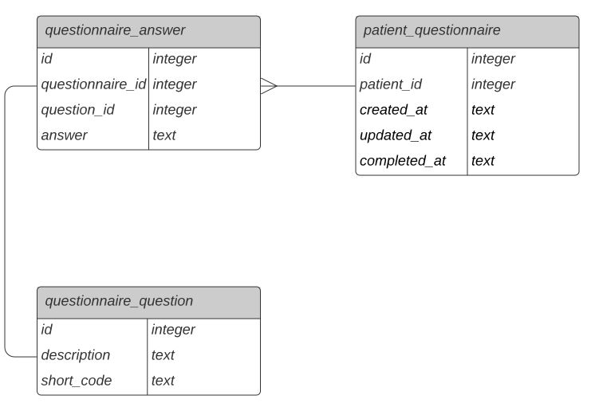

## Getting Started

### Requirements

- Git
- Node
- Yarn or npm

### Running the app (REST API)

```
npm i && npm run start
```

### Running the app (GraphQL API)

```
npm i && npm run graphql-gen-types && npm run start-graphql
```

### Running the tests

```
npm i && npm run test
```

### Running the server with nodemon (REST API)

```
npm run dev
```

### Running the server with nodemon (GraphQL API)

```
npm run graphql-gen-types && npm run dev-graphql
```

## Context

At Eucalyptus we gather information from our patients in the form of answers to questionnaires. Often a patient will answer multiple questionnaires over their time with Eucalyptus, with overlap in the questions asked.

Recently engineers within Eucalyptus have expressed that they have found it complicated to utilise this data in its current format, and so we're looking at providing a simplified interface.

### Data Model



## Requirements

- Design a REST or GraphQL API that allows retrieving the following properties for a patient:
  - Date of birth
  - First name
  - Last name
  - Allergies
  - Medications
- Integrate the API with the SQLite database in `./questionnaire.db`
- Handle multiple answers from the same patient for the same question on different dates
  - This requirement is purposefully vague, as we are curious to see how you approach this task, and what assumptions you choose to make

## Tips

We'll be looking for:

- A well-defined and extensible API schema.
- A well-designed and secure implementation.
- Production quality code.
- Clearly communicated assumptions.
- Useful and well structured tests.
- A functionally correct solution (we'll be running some tests using the sample data).

##  Assumptions made
- REST API to retrieve the properties given above for the patient
  - Patient Id will be the input
  - If a patient has submitted the questionnaire multiple times, then the answers of the latest questionnaire will be considered
  - If latest answer of either allegies or medications are not provided then the last latest answer to be considered is not done yet
- API authentication and authorization is done using JWT token validation
- API JWT token send in authorization header as Bearer token
- Added a signin API to generate the Bearer token with dummy credentials

##  Database schema changes made
- patient_questionnaire table was missing questionnaire_id column
- ALTER TABLE patient_questionnaire ADD COLUMN questionnaire_id INTEGER
- Added questionnaire_id values from questionnaire_answer

## Implementation features
### REST API
- API schema defined with JSON schema
- Used knex querybuilder lib for Database so that it can be scaled to a other databases on production
- Used express middleware and its corresponding libs for jwt, json schema validation
- Unprotected routes are defined
- Added unit tests for service and data access functions
- Swagger API explorer on http://localhost:8500/api-docs/
### GraphQL API
- studio.apollographql http://localhost:8500/graphql

## Further assumptions
For extensible API and functionality, I imagine that the database schema definition could be bit different.
Below is just a high level idea of the database schema could be


Below were referred for consideration

To see if there are any standard or common referrences of allergies or medications could be used

https://www.healthdirect.gov.au/allergies

https://www.nps.org.au/australian-prescriber/articles/commonly-prescribed-medications-labelling-and-advice-from-the-pharmacist-wall-chart

For consumer data right, consumer consent and authorisation, data deleted or deidentified, etc

https://www.oaic.gov.au/consumer-data-right
